# Achiver - A pomodoro timer and tracker (WIP)

A pomodoro style timer and time tracker made with flutter. Only tested on android for now.

Pull requests are most welcome.

## How to run?

You need to create a firebase project, enable firestore database, google sign in, and add your google-services.json.

## Screenshots
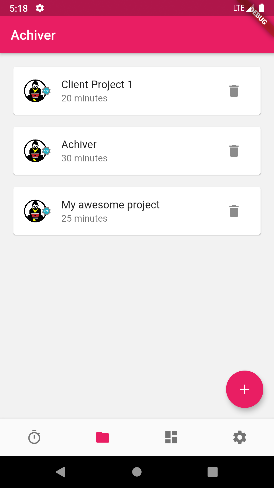 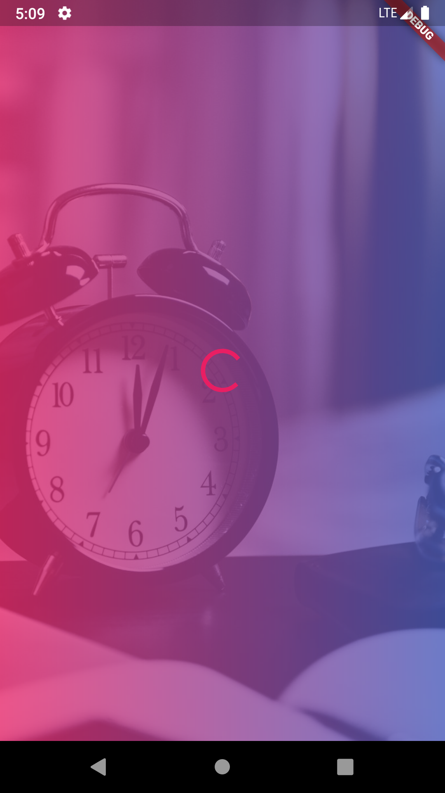 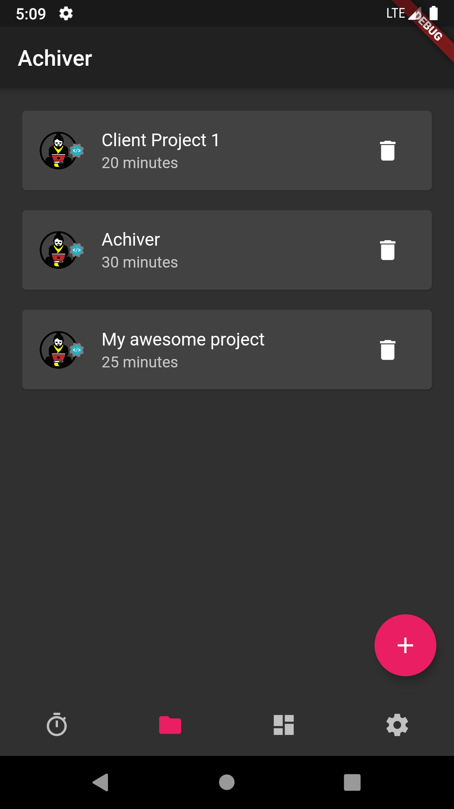 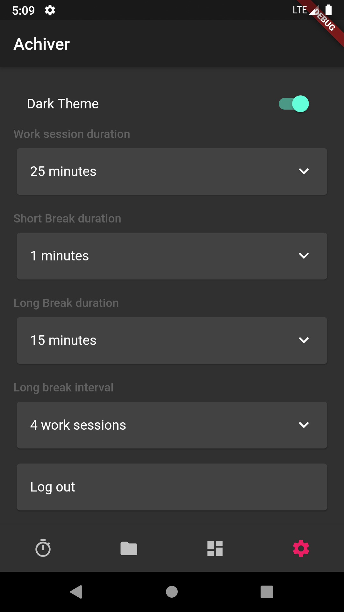 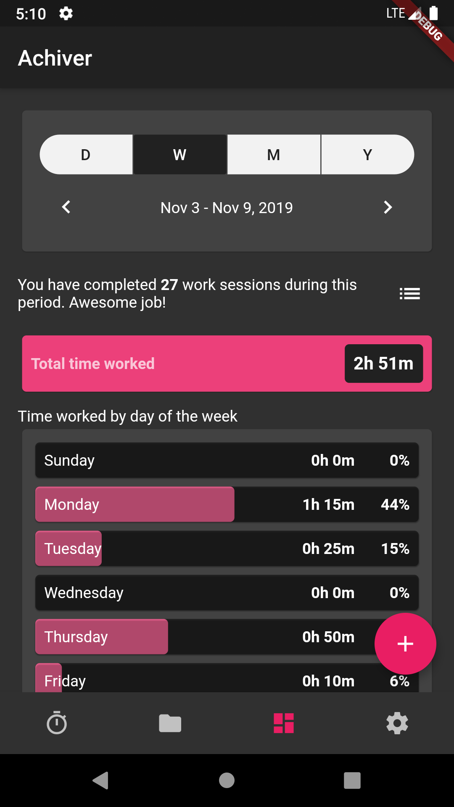 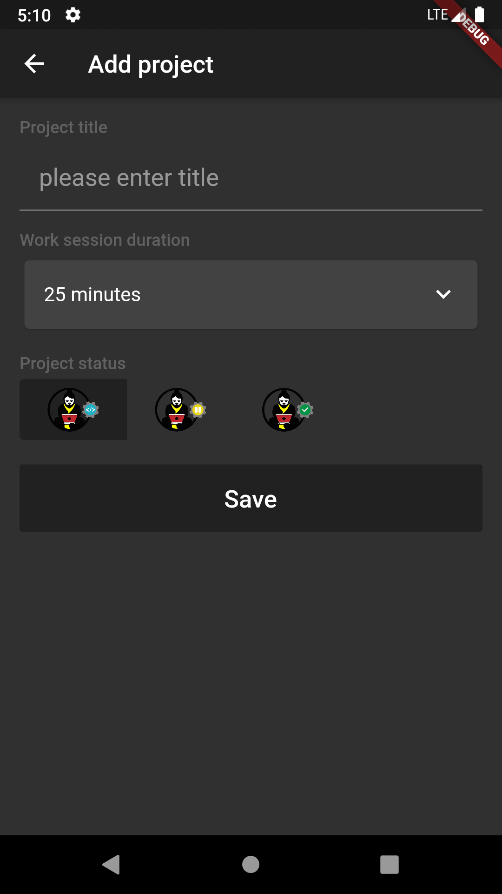 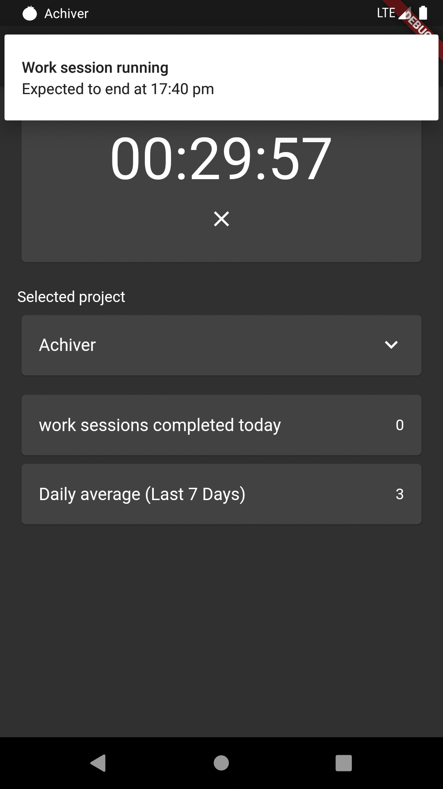 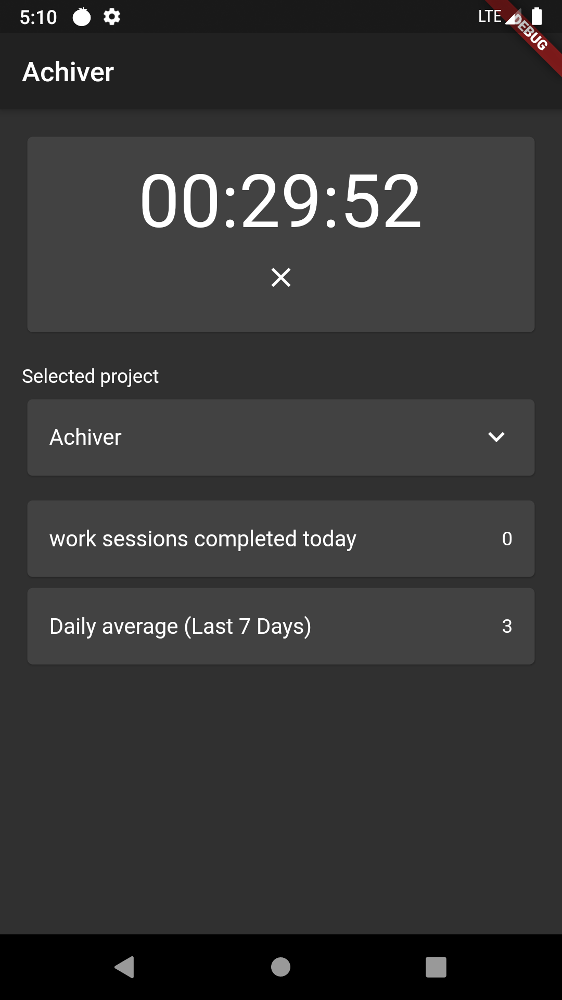 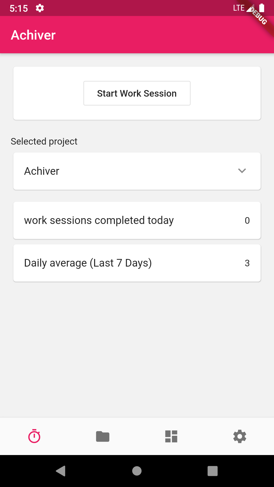 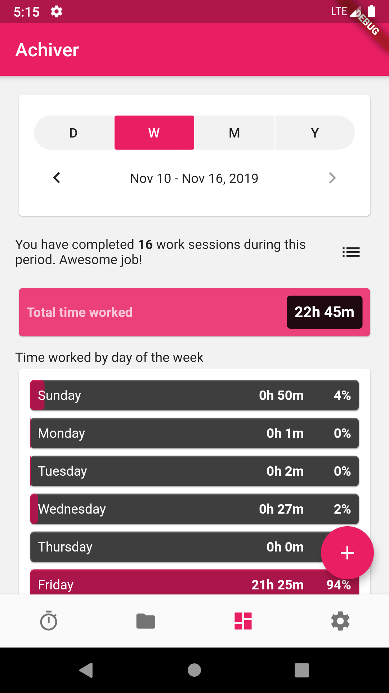 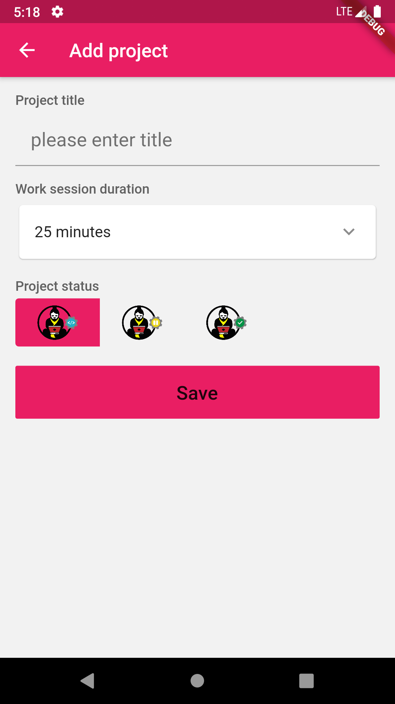 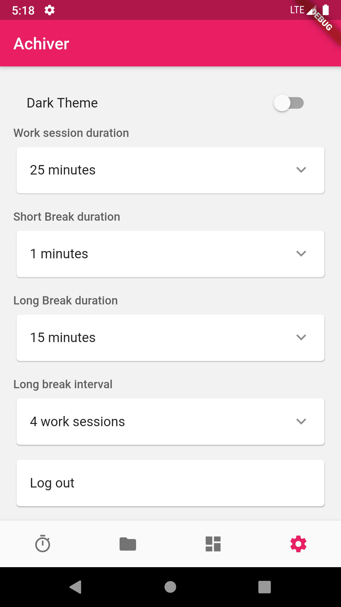 

## Getting Started

This project is a starting point for a Flutter application.

A few resources to get you started if this is your first Flutter project:

- [Lab: Write your first Flutter app](https://flutter.dev/docs/get-started/codelab)
- [Cookbook: Useful Flutter samples](https://flutter.dev/docs/cookbook)

For help getting started with Flutter, view our
[online documentation](https://flutter.dev/docs), which offers tutorials,
samples, guidance on mobile development, and a full API reference.
